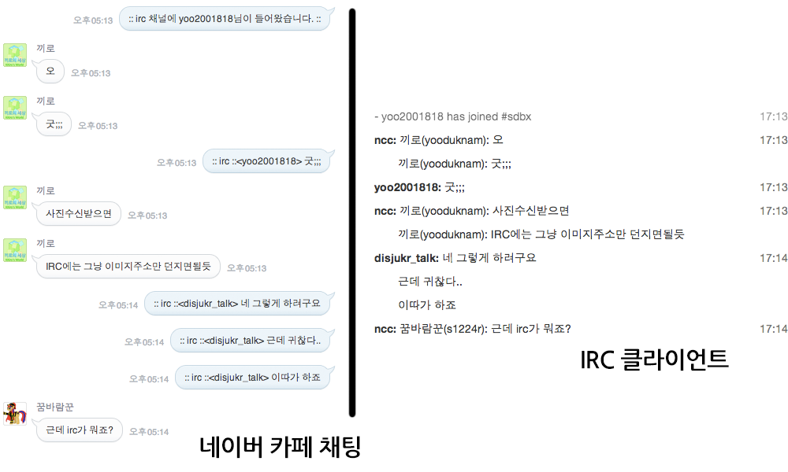

never cafe chat
===
네이버 카페 채팅방과 irc 채널간 중계 봇입니다.
MIT 라이센스 하에 배포합니다.



## 설치 및 실행

### Mac OS X
```sh
brew install git
brew install node
brew install phantomjs
git clone https://github.com/disjukr/never-cafe-chat.git
cd never-cafe-chat/
npm install .
node index.js
```

### Ubuntu
```sh
sudo apt-get install build-essential
sudo apt-get install git
sudo apt-get install nodejs
sudo apt-get install phantomjs
git clone https://github.com/disjukr/never-cafe-chat.git
cd never-cafe-chat/
npm install .
node index.js
```

## 트러블 슈팅

리눅스에서 실행했는데 phantomjs 에러가 뜨면서 카페 채팅 중계가 안되는 경우
설정파일의 `user-agent`를 리눅스용 브라우저 값으로 맞춰보세요.

예시: `Mozilla/5.0 (X11; U; Linux i686; en-US; rv:1.8.1.19) Gecko/20081202 Firefox (Debian-2.0.0.19-0etch1)`

## Thanks to

 * IRC 클라이언트 종료를 열심히 테스트 해준 [yoo2001818](https://github.com/yoo2001818)님
 * 이런 귀찮은 것을 구현하게 만든 <del>원흉</del> [네이버 샌드박스 카페](http://cafe.naver.com/sdbx)
